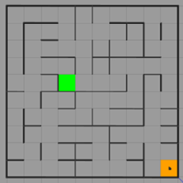
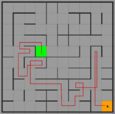
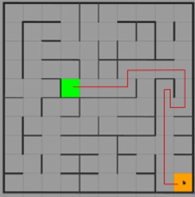
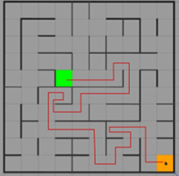

# Turtlebot3 Robot Path Planning Simulation

## Objective

This project involves simulating a TurtleBot3 robot to manoeuvre within a maze to reach a designated destination cell. TurtleBot3 is expected to navigate the maze autonomously from initial cell (0,0) which is in orange to destination cell (5,6) which is in green.

---

## Control and Path Planning

### Path Planning Algorithm

- The path planning algorithm uses **Breadth-First Search (BFS)** to determine the optimal route through the maze.

### PID Controller

- A **Proportional-Integral-Derivative (PID) controller** is used for:
  - Controlling **forward/backward motion**
  - Managing **steering**

- The PID controller is a critical component for navigation.

- **Precise tuning** of the PID parameters is necessary to:
  - Ensure smooth and accurate movement
  - Prevent the TurtleBot3 from colliding with the maze walls

---

## Path Planning: Breadth-First Search (BFS)

The path planning algorithm uses **Breadth-First Search (BFS)** to determine the optimal route through the maze. The implementation follows these steps:

- **Neighbor Search Order**:
  - From the current cell, BFS explores adjacent neighbors in a fixed priority order: **North → West → South → East**

- **Cost Evaluation**:
  - Only the cheaper adjacent cell (based on priority) is queued
  - The cost is calculated using the **Chebyshev distance**, which is 1 for 4-connected grids

- **Path Planning**:
  - BFS uses this cost information to generate a path and selects an **intermediate target cell**
  - This target cell is then **published** for the robot to follow

- **Replanning**:
  - As the robot navigates, it may encounter maze walls
  - If an obstacle is detected, the algorithm **repeats steps 1–3** to replan the path dynamically

- **Destination Reached**:
  - When the robot reaches the destination cell, the queue is checked
  - The first element of the queue is:
    - Assigned to the `cur_node` pointer
    - Popped from the queue to avoid reprocessing
  - The algorithm checks if this node is the destination:
    - If true, it traces back through the **parent nodes** to construct the path
    - The final path is pushed into the **path vector** and published

---

## PID Control and Tuning

PID tuning in **Project 2 (P2)** highlighted the importance of the **derivative gain** (`Kd_a`) in robot navigation.

- **Derivative Gain (`Kd_a`)**:
  - Indirectly controls the **speed of turning**
  - **Higher `Kd_a`** enables quicker detection and response to maze walls
  - Especially critical in **tight spaces**, such as cells surrounded by walls on 3 sides
  - **Drawback**: Increasing `Kd_a` can lead to **oscillations**, observed as sudden swerves in the robot’s motion

> **Note**: All three gains (`Kp`, `Ki`, `Kd`) are set to **small values** since even slight adjustments can significantly affect the TurtleBot3's behavior

### Final Gain Values and Effects

| Final Gain Values | Heading | Angular | Effect of Increasing Parameters |
|-------------------|---------|---------|---------------------------------|
| Kₚ                | 0.4     | 1.0     | Increases robot’s velocity, making it difficult for the robot to turn or react to obstacles. |
| Kᵢ                | 0.01    | 0.01    | Increases overshoot, leading to the robot crashing into the walls. |
| Kᴅ                | 0.0004  | 0.0008  | Increases oscillation, which introduces sudden swerves. |

---

### Simulation Results

Using the provided code and the above gain values, TurtleBot3 followed the path highlighted in red. The final path included:

- **35 cells**, including a few dead ends  
- **Total time**: 1.49 minutes  
- **Distance**: Includes retraced segments and the final destination cell  
- **Steady-state error**: Observed, as the robot does not stop precisely at the center of a cell, despite introducing a non-zero `Kᵢ` value

**Performance Insight**:  
Although the robot successfully reached the destination, the overall performance could be improved by optimizing the path to reduce traversal time.

---

### Enhancements

#### 1. Use of Euclidean Distance for Cost Calculation

- Replacing **Chebyshev distance** with **Euclidean distance** for cost calculation helps avoid unnecessary movements that do not effectively reduce the distance between the robot and the target
- **Path Length**: 33 cells  
- **Time Taken**: 1.39 minutes

---

#### 2. Optimized Direction Priority for Path Planning

- Modified the direction-checking priority in `path_plan_node.cpp` to:  
  **North → East → West → South**

- This adjustment was based on maze analysis to ensure the robot follows the shortest Chebyshev path

**Outcome**:
- **Path Length**: 16 cells  
- **Time Taken**: 52 seconds

> Note: While effective in this maze, this modification may negatively impact performance in other maze configurations, where the shortest path does not favor the east direction

